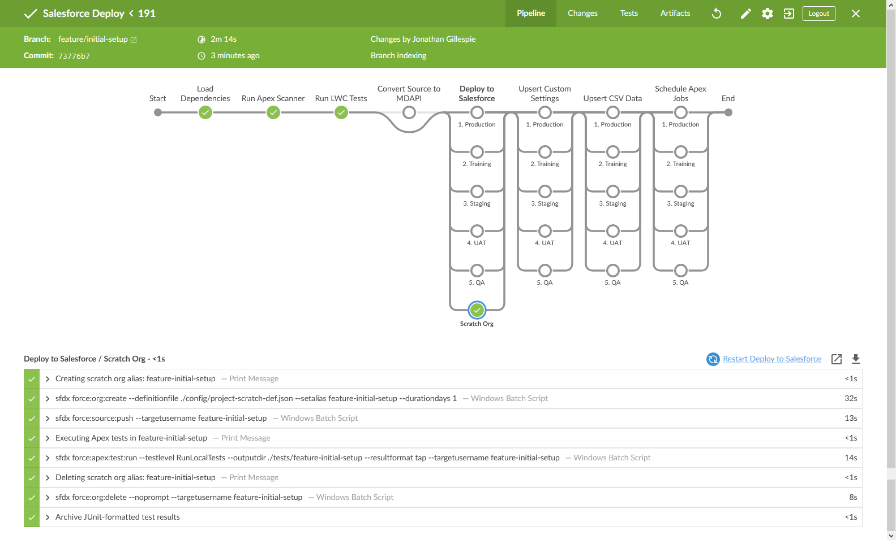

# Advanced Salesforce SFDX Deployments with Jenkins

Jenkins is a great automation server to use for your Salesforce deployment pipeline. It's free ($0 and open source), can be installed on nearly any OS, and has a huge library of plugins. Salesforce even (has some examples of setting it up)[https://developer.salesforce.com/docs/atlas.en-us.sfdx_dev.meta/sfdx_dev/sfdx_dev_ci_jenkins.htm].

However, the examples on Salesforce's developer site are simpler examples of either deploying to a single sandbox or a single scratch. But in reality, many Salesforce projects need to deploy to several environments (for QA, user testing, and so on) - and Jenkins should handle automatically deploying to all environments as needed.

This repository is an example of how you can deploy to multiple Salesforce enviornments using Jenkins and SFDX. The metadata included in the `force-app` folder is just for demonstration purposes.

## What It Looks Like

When new commits are pushed to `feature/*` and `bugfix/*` branches, a new scratch org is automatically used to deploy the metadata and run Apex test results


When new commits are pushed to the `develop` branch, the metadata is automatically deployed to the `QA` sandbox for internal testing.


When new commits are pushed to the `uat` branch, the metadata is automatically deployed to the `UAT` sandbox for user acceptance testing.


When new commits are pushed to `release/*` branches, the metadata is automatically deployed to the `Staging` sandbox for pre-production validation.


When new commits are pushed to the `main` branch, the metadata is automatically deployed in parallel to the both `Production` and the `Training` sandbox.


## What It Does

The deployment process itself is controlled by `Jenkinsfile` (stored in the repo's root directory). It uses `SFDX` commands to handle several common deployment steps:

| Deployment Step                           | Purpose                                                                                                                                                                                                                                 |
| ----------------------------------------- | --------------------------------------------------------------------------------------------------------------------------------------------------------------------------------------------------------------------------------------- |
| Continuous Integration using Scratch Orgs | For `feature/*` and `bugfix/*` branches, scratch orgs are automatically created & used to deploy all metadata, run Apex tests and store the results in Jenkins                                                                          |
| Sandbox Deployments                       | 4 sandboxes are used - but this approach scales well and it can easily be changed to use more (or fewer) environments, depending on your project's needs. (I've used this approach for automatically deploying to 12+ sandboxes)        |
| Parallel Deployments                      | This repo runs parallel deployments to 2 environments, `Production` and `Training`, any time there is a change merged to the `main` branch. Not all projects need to run parallel deployments, but it's useful on more complex projects |
| Diff-only Prod Deployments                | Diff-only deployments to production using the [SFDX-Git-Delta](https://github.com/scolladon/sfdx-git-delta) plugin, including automatically generating & deploying `destructiveChangesPost.xml`                                         |
| Static Code Analysis                      | For `feature/*` and `bugfix/*` branches, static code analysis is automatically run on Apex code using Salesforce's [SFDX Scanner plugin](https://forcedotcom.github.io/sfdx-scanner)                                                    |
| Upsert Custom Settings                    | Runs a post-deployment script to upsert `MyCustomSetting__c` custom setting                                                                                                                                                             |
| Upsert SObject data                       | Automatically upserts CSV data after the deployment                                                                                                                                                                                     |
| Schedule Apex Jobs                        | Run a post-deployment script to (re-)schedule the Apex job `MySchedulableJob`                                                                                                                                                           |

## Important Files

If you want to leverage this same approach for your project, then you'll want to use these files:

-   [Jenkinsfile](Jenkinsfile) - this contains the Jenkins pipeline definition, which tells Jenkins how to run the deployment (using SFDX commands)
-   [Jenkins.sfdx-scripts.groovy](Jenkins.sfdx-scripts.groovy) - this custom file contains several scripts used by `Jenkinsfile` (primarily, SFDX commands)
-   [Jenkins.sfdx-environments.json](Jenkins.sfdx-environments.json) - a custom JSON file that contains details about your Salesforce environments. This is used by Jenkins when deploying.
-   [sfdx-project.json](sfdx-project.json) - any metadata with the `packageDirectories` paths is deployed by Jenkins. Multiple directories/paths are supported.
-   [package.json](package.json) - within this file (or your own version of the file), these package dependencies are needed
    ```json
    "scripts": {
        "install-sfdx-git-delta": "sfdx plugins:install sfdx-git-delta",
        "install-sfdx-scanner": "sfdx plugins:install @salesforce/sfdx-scanner"
    }
    "devDependencies": {
        "@salesforce/sfdx-scanner": "^2.8.0",
        "sfdx-git-delta": "^4.3.1"
    }
    ```
-   [scripts/deployment/ directory](./scripts/deployment/) - this directory contains Apex and Python scripts used for post-deployment steps

## Required Software/Tools

-   [Jenkins server](https://jenkins.io) with these plugins
    -   [Blue Ocean](https://plugins.jenkins.io/blueocean)
    -   [Pipeline Utility Steps](https://plugins.jenkins.io/pipeline-utility-steps/)
    -   [Warnings Next Generation](https://plugins.jenkins.io/warnings-ng/)
    -   [Workspace Cleanup](https://plugins.jenkins.io/ws-cleanup/)
-   [SFDX (Salesforce CLI)](https://developer.salesforce.com/tools/sfdxcli) installed on the Jenkins server/build agents
-   [PMD](https://github.com/pmd/pmd/releases) installed on the Jenkins server/build agents

## Git Branches

This repo uses [git-flow](https://nvie.com/posts/a-successful-git-branching-model/) as the branching model/branch naming convention.

### Git Named Branches

This repo uses the following named branches

-   `main` - your production metadata. In this repo, the [SFDX-Git-Delta](https://github.com/scolladon/sfdx-git-delta) plugin is used to only deploy changed metadata to production (instead of deploying the entire repo).
-   `uat` - your stable build branch, used for user-acceptance testing before deploying to production
-   `develop` - your development branch. Any `feature` or `bugfix` branches are created from `develop`

### Git Branch Prefixes

This repo also uses the following branch prefixes.

-   `release/*` - Release branches are used to verify the production deployment process by first deploying to a Staging sandbox. This sandbox should be a clone of the production environment.
-   `hotfix/*` - Hotfix branches are used when fixing critical production-level bugs.
-   `feature/*` - These are used when developing new features & enhancements.
-   `bugfix/*` - These are for non-critical bugs (i.e., the bug is not critical enough to warrant a production hotfix).

## Salesforce Environments

This repo uses these Salesforce environments for example purposes. You can add and remove environments as needed - the process itself scales well.
|Environment Name|Purpose|
--- | ---
|`Production`|Your live Salesforce environment
|`Training`|A sandbox used for training purposes. Deployments to `Production` and `Training` run in parallel.
|`Staging`|A sandbox that matches production, used for testing the deployment process for `release/*` and `hotfix/*` branches before deploying to production
|`UAT`|A sandbox used for user-acceptance testing
|`QA`|A sandbox used for internal testing
|`Scratch Orgs`|When validating `feature` and `bugfix` branches (discussed below), a scratch org is created & used to validate that the metadata is deployable, and that all unit tests are passsing.

## Configuring Salesforce Credentials for Jenkins

The SFDX Auth URL for each Salesforce environment must be stored in Jenkins's credentials manager. This lets Jenkins connect to your Salesforce orgs to run the deployments.
